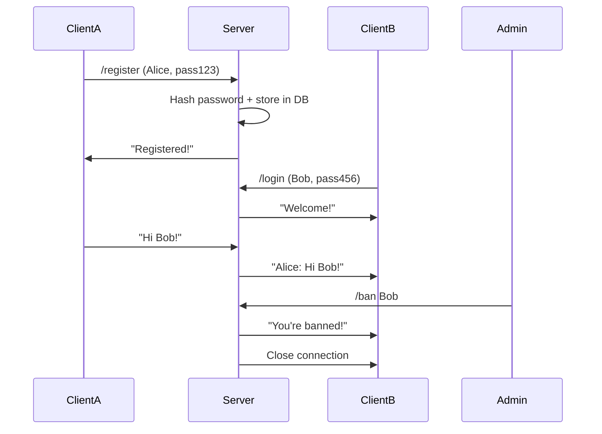

# 🔌 ThreadIP
*A modular, thread-safe chat server with admin controls — built with Python sockets.*


---

## 🚀 Features  
- **Secure Auth**: SHA-256 + salt hashing for passwords.  
- **Admin Moderation**: Kick/ban/mute users, broadcast messages.  
- **Thread-Safe**: No race conditions (thanks to `threading.Lock`).  
- **Logging**: All actions tracked in `session.log`.  
- **Easy Setup**: Runs on any machine with Python 3.9+.  


---

## ⚡ Quick Start  

### 1. Clone the Repo  
```bash
git clone https://github.com/yourname/ThreadIP.git
cd ThreadIP
```

### 2. Run the Server  
```bash
python main_server.py
# Output: [+] Server started on 0.0.0.0:12345
```

### 3. Connect Clients  
```bash
python client.py
# Enter server IP (e.g., 192.168.1.100)
```

---

## 🛠️ Tech Stack  
| Component       | Purpose                          |  
|-----------------|----------------------------------|  
| `socket`        | Low-level networking             |  
| `threading`     | Handle multiple clients          |  
| `sqlite3`       | Store users/mutes/bans           |  
| `hashlib`       | Password hashing                 |  

---

## 📜 Admin Commands  
| Command         | Action                          | Example                |  
|-----------------|---------------------------------|------------------------|  
| `/ban user`     | Ban a user                      | `/ban spammer123`      |  
| `/mute user`    | Mute a user                     | `/mute noisy_user`     |  
| `/broadcast`    | Send to all users               | `/broadcast Hi all!`   |  

---

## 🔧 Troubleshooting Guide
Can't Connect? → Check: 
1. Server running? → netstat
2. Port open? → https://portchecker.co
3. Firewall disabled? → netsh firewall show state
4. Correct IP? → curl ifconfig.me

---

## 🤝 Contribute  
1. Fork the repo.  
2. Add a feature (e.g., encryption, file sharing).  
3. Submit a PR!  

**First time?** Try:  
- Adding emoji support (`utils.py`).  
- Implementing a `/help` command.  

---

## 📄 License  
MIT © DenjiMakesGames  
